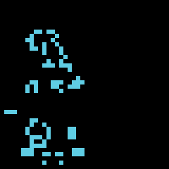
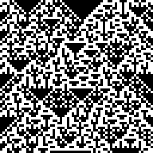

# Cellular Automata

A **Cellular Automaton** is a mathmatical computational model consisting of a **state grid** and a **progression rule**.

The **state grid** (also called _cell grid_, _grid_ or sometimes just _state_) is _cellular_, i.e. it is a finite-dimensional (usually 1D or 2D) grid of cells, where each of the cells is in one of a (often finite) number of _cell states_.
Depending on the autamaton studied, this grid can be finite, infinite or have a so called _periodic boundary_ where cells on one end of the grid are considered adjacent to those at the other edge, forming a pseudo-infinite wrap-around.

The **progression rule** on the other hand describes how one state of the automaton can be transformed into the next. It can take many different forms -- in this book, we will discuss [pattern replacment] and [enviroment functions] -- and may even be non-deterministic.
The only constraint is that it must be a function taking in a state grid and returning another of the same dimensions and with each cell still having a value within the allowed cell states.

**Running** a cellular automaton now describes the process of repeatedly applying the progression rule to the state grid and studying its evolution over time.
Cellular automata are mostly interesting from a purely mathematical perspective, but some of them can use the evolution of their state to solve certain computational problems.
While this is seldom efficient, the simple nature of such automata can be useful when researching theoretical models of computation.

A state in the famous _Game Of Life_ automaton, one of the first cellular automatons to be extensively studied.

Multiple states of the one-dimensional _Rule90_ automaton. Each row, from the top to the bottom, represents a state of the automaton.